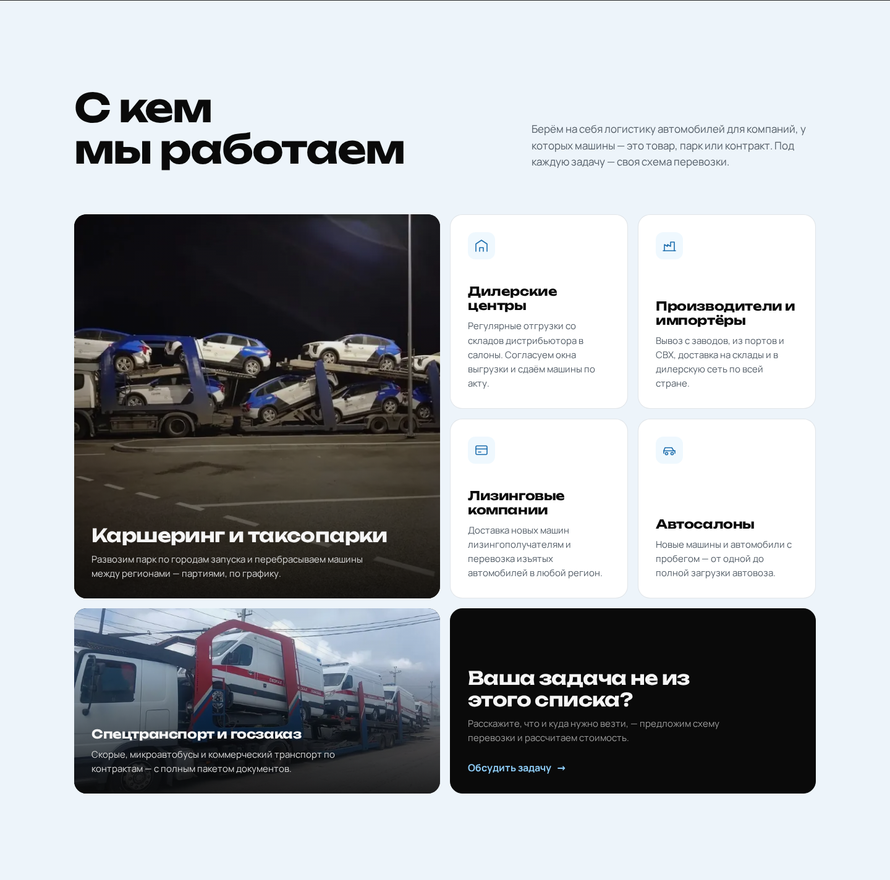
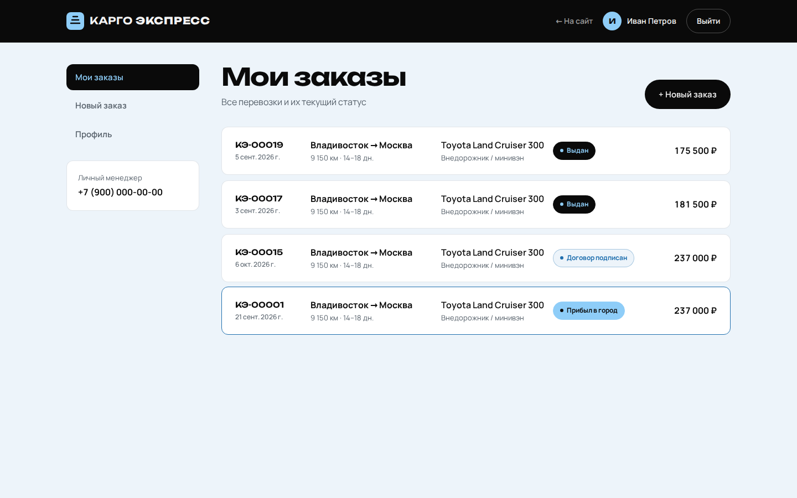
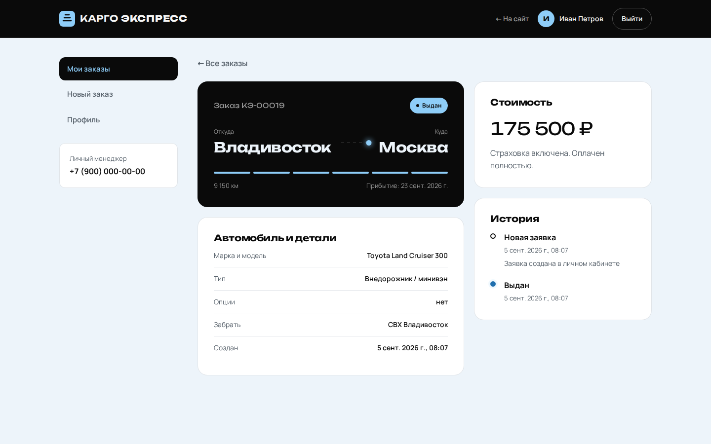
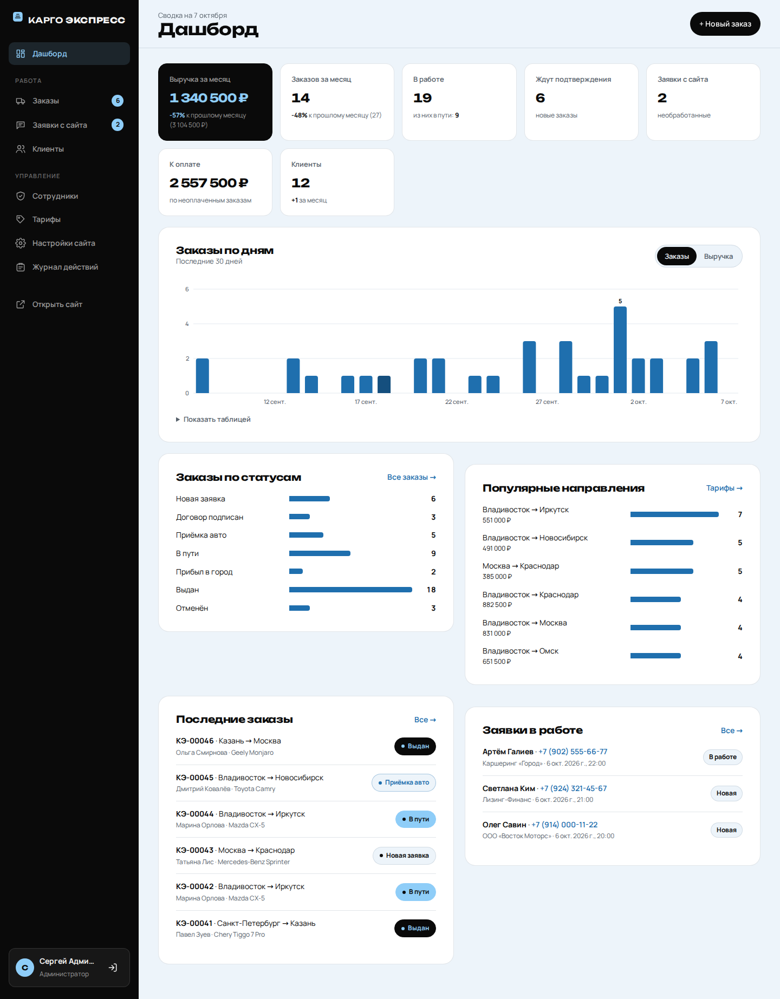
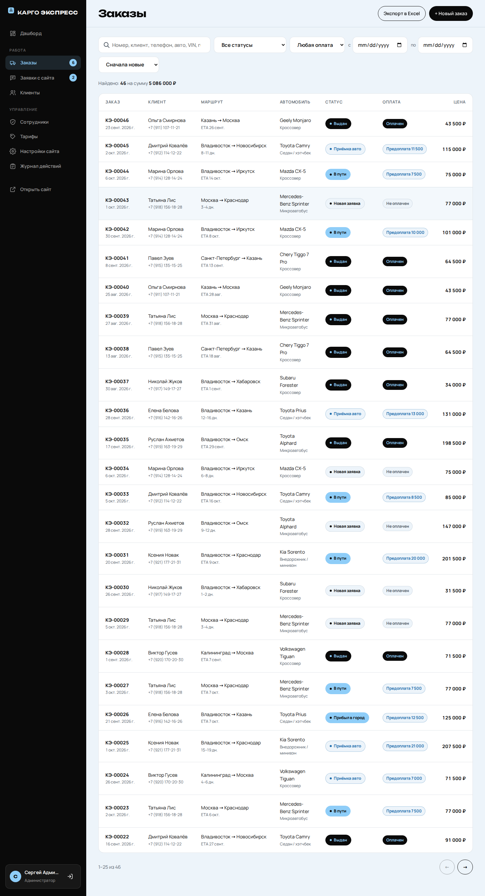
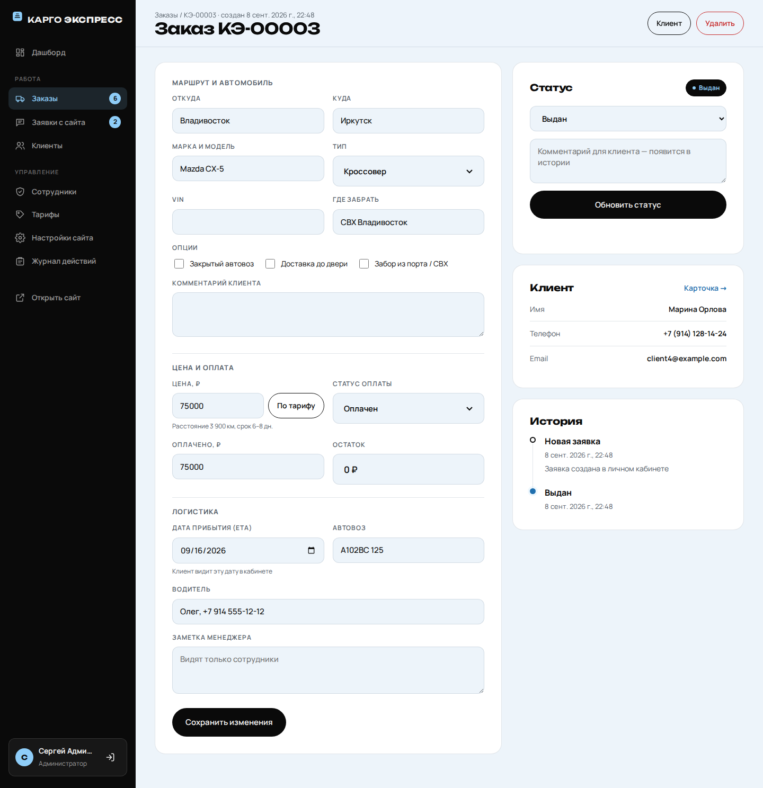
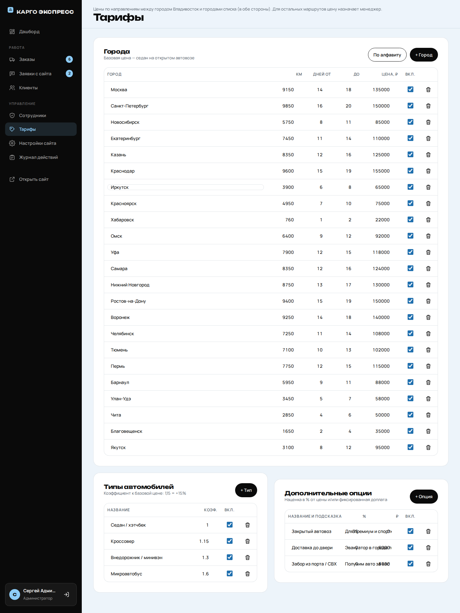
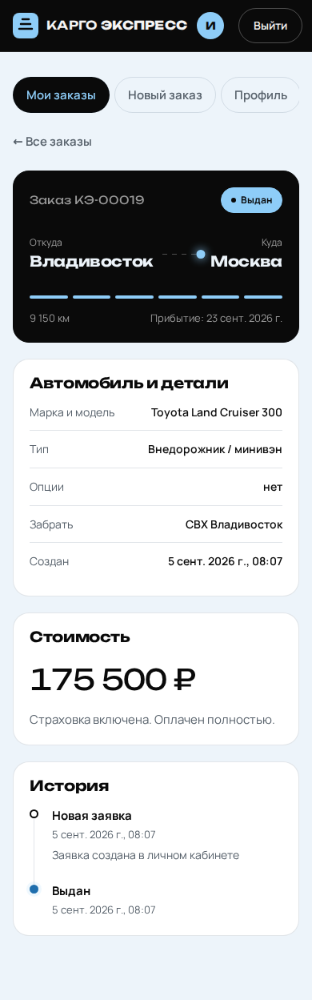
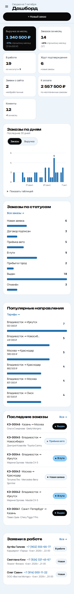

# Карго Экспресс — перевозка автомобилей автовозами по всей России

Сайт-визитка для компаний-партнёров (дилеры, производители, лизинг, каршеринг, госзаказчики),
личный кабинет клиента и админ-панель для сотрудников.
Чёрно-белый дизайн со светло-синими акцентами, реальные фото автопарка, адаптив под телефоны.

> Телефон, email и реквизиты — заглушки, текст «О компании» — временный. Всё это меняется
> в админ-панели («Настройки сайта»). Формулировки преимуществ на главной стоит сверить с компанией.

## Что есть

**Главная** (`/`) — визитка для бизнеса
- Первый экран с фото автовоза, «С кем мы работаем» (сегменты клиентов), услуги (фото меняется
  при наведении), этапы работы, карта маршрутов по России, галерея рейсов с просмотром фото,
  преимущества, «О компании», FAQ, форма заявки на сотрудничество (компания, контакт, email, задача).
- Контакты, текст «О компании» и реквизиты подгружаются из настроек — их меняют в админ-панели.

**Личный кабинет клиента** (`/account.html`)
- Регистрация и вход по email и паролю.
- Заказ по любому маршруту «откуда → куда». Если на маршрут есть тариф — цену считает сервер,
  иначе заказ создаётся «по запросу» и цену назначает менеджер.
- Список заказов, карточка заказа с прогрессом, историей статусов, датой прибытия и статусом оплаты,
  отмена новой заявки, профиль, смена пароля.

**Админ-панель** (`/admin.html`) — для сотрудников с ролью «Менеджер» или «Администратор»

| Раздел | Что умеет | Доступ |
|--------|-----------|--------|
| Дашборд | Выручка и заказы за месяц с сравнением к прошлому, заказы в работе, неоплаченное, новые заявки и клиенты; график заказов/выручки за 30 дней; статусы; топ направлений; последние заказы и заявки | все сотрудники |
| Заказы | Поиск (номер, клиент, телефон, авто, VIN, города), фильтры по статусу, оплате и датам, сортировка, выгрузка в Excel (CSV). Карточка: маршрут «откуда → куда», авто, опции, цена (вручную или «по тарифу»), оплата, ETA, автовоз, водитель, заметка менеджера, смена статуса с комментарием для клиента | все; удаление — админ |
| Новый заказ | Оформление по звонку: выбор клиента из базы или новый клиент, любой маршрут, расчёт по тарифу или своя цена | все |
| Заявки с сайта | Компания, контакт, email и задача; статусы (новая / в работе / обработана / спам), комментарии, «В заказ» — заказ по заявке в один клик (маршрут подставляется из текста заявки) | все; удаление — админ |
| Клиенты | Поиск, сумма и число заказов, карточка клиента, редактирование, заметки, установка пароля от кабинета, блокировка | все |
| Сотрудники | Добавление менеджеров и админов, смена роли, пароля, блокировка | админ |
| Тарифы | Направления между Владивостоком и городами списка в обе стороны (км, сроки, цена), типы авто (коэффициент), опции (% и/или ₽), включение/отключение | админ |
| Настройки сайта | Телефон, email, адрес, часы работы, мессенджеры, текст «О компании», реквизиты | админ |
| Журнал действий | Кто, когда и что менял | админ |

## Скриншоты

Все снимки лежат в [`docs/screenshots/`](docs/screenshots) и пересоздаются командой `npm run screenshots`
(сайт поднимается на временной базе с демо-данными).

| Главная | С кем работаем |
|---|---|
|  |  |

| География | Автопарк |
|---|---|
|  |  |

| Кабинет клиента: заказы | Кабинет клиента: заказ |
|---|---|
|  |  |

| Админка: дашборд | Админка: заказы |
|---|---|
|  |  |

| Админка: заказ | Админка: тарифы |
|---|---|
|  |  |

| Телефон: сайт | Телефон: заказ клиента | Телефон: админка |
|---|---|---|
|  |  |  |

Остальные разделы — заявки, клиенты, сотрудники, настройки, журнал, остальные блоки главной — в той же папке.

## Запуск

Нужен **Node.js 22.5+**: база данных — встроенный `node:sqlite`, нативных модулей нет.

```bash
npm install
npm run create-admin -- admin@example.com 'надёжный-пароль' 'Имя'
npm start            # http://localhost:3000, админка — http://localhost:3000/admin.html
```

- `npm run create-manager -- email пароль [имя]` — создать менеджера (или сделать это в разделе «Сотрудники»).
- `npm run demo` — сайт на отдельной демо-базе с заказами, клиентами и заявками (логины выводятся в консоль).
- `npm run screenshots` — обновить скриншоты в `docs/screenshots/` (снимки удалённых страниц удаляются).
  Перед первым запуском один раз: `npm install` и `npm run screenshots:setup` (скачает браузер Chromium, ~150 МБ).
- `npm run photos` — подготовить фото для сайта: исходники из `media/photos/*.jpg` → `public/img/work/*.webp`.
- `npm run dev` — перезапуск сервера при изменениях.
- `npm test` — тесты API.

База создаётся автоматически в `data/app.db` (папка в `.gitignore`, её нужно бэкапить).
Схема обновляется миграциями при запуске: старая база с данными переносится автоматически.

### Переменные окружения

| Переменная    | По умолчанию   | Назначение |
|---------------|----------------|------------|
| `PORT`        | `3000`         | Порт сервера |
| `DB_PATH`     | `data/app.db`  | Путь к файлу SQLite |
| `NODE_ENV`    | —              | `production` включает флаг `Secure` у cookie (нужен HTTPS) |
| `TRUST_PROXY` | —              | `true` или `1`, если сервер стоит за nginx/балансировщиком |

## Безопасность

- Пароли хэшируются через scrypt с солью; сравнение за постоянное время.
- Сессии: случайный токен в `HttpOnly`, `SameSite=Lax` cookie, в БД хранится только его SHA-256; срок — 30 дней.
  Смена пароля, роли или блокировка завершают сессии пользователя.
- Роли проверяются на сервере для каждого запроса; клиент видит только свои заказы и не видит внутренних полей.
- CSRF: запросы с телом принимаются только как `application/json`, все изменяющие — только с того же origin.
- Ограничение частоты для входа, регистрации, заявок и заказов (10 в минуту).
- Заголовки CSP, `X-Frame-Options`, `nosniff`; весь пользовательский ввод экранируется при выводе;
  в CSV-выгрузке экранируются формулы Excel.
- Нельзя заблокировать или понизить себя и удалить последнего администратора.
- Клиента, созданного менеджером без пароля, нельзя «занять» регистрацией с его email.

## Как поменять контент

- **Контакты, «О компании», реквизиты, тарифы** — в админ-панели («Настройки сайта», «Тарифы»).
  Начальные значения для новой базы — в `public/tariffs.js` и `server/db.js`.
- **Тексты главной** — `public/index.html`.
- **Фотографии** — положите исходник в `media/photos/` и выполните `npm run photos`; затем добавьте
  `img/work/<имя>-800.webp` в разметку (например, в галерею `#gallery`).
- **Цвета и шрифты** — переменные в начале `public/styles.css` (`--accent` — голубой акцент).

## Структура

```
public/              статика
  index.html         главная            script.js, styles.css
  img/work/          фото для сайта (создаются npm run photos)
  account.html       кабинет клиента    account.js, account.css
  admin.html         админ-панель       admin.js, admin.css
  tariffs.js         расчёт стоимости и справочники (общий для браузера и сервера)
  site.js            подстановка контактов из настроек
server/
  index.js           Express-приложение, заголовки безопасности, CSRF
  api.js             API сайта и кабинета клиента
  admin.js           API админ-панели
  orders.js          общие запросы и сериализация заказов
  store.js           тарифы, настройки, журнал действий
  auth.js            пароли, сессии, роли, лимитер
  validate.js        проверка входных данных
  db.js              схема SQLite и миграции
scripts/
  create-staff.js    создание администратора/менеджера
  demo.js, demo-data.js   демо-база
  screenshots.js     генератор скриншотов
  photos.js          подготовка фото
media/photos/        исходные фотографии
docs/screenshots/    скриншоты
test/                тесты API (node:test)
```

## API

| Метод | Путь | Доступ |
|-------|------|--------|
| GET | `/api/tariffs`, `/api/settings` | все |
| POST | `/api/auth/register`, `/api/auth/login`, `/api/auth/logout` | все |
| GET / PATCH | `/api/me` | пользователь |
| POST | `/api/me/password` | пользователь |
| GET / POST | `/api/orders` | клиент (свои заказы) |
| GET | `/api/orders/:id` | владелец |
| POST | `/api/orders/:id/cancel` | владелец, только статус `new` |
| POST | `/api/leads` (`name`, `phone`, `company`, `email`, `message`) | все |
| GET | `/api/admin/dashboard` | сотрудник |
| GET / POST | `/api/admin/orders` (`?q=&status=&payment=&from=&to=&sort=&page=`) | сотрудник |
| GET | `/api/admin/orders.csv` | сотрудник |
| GET / PATCH | `/api/admin/orders/:id` | сотрудник |
| POST | `/api/admin/orders/:id/status` | сотрудник |
| DELETE | `/api/admin/orders/:id` | админ |
| GET, PATCH | `/api/admin/leads`, `/api/admin/leads/:id` | сотрудник; DELETE — админ |
| GET / POST | `/api/admin/clients` | сотрудник |
| GET / PATCH | `/api/admin/clients/:id`; POST `/api/admin/clients/:id/password` | сотрудник |
| GET / POST / PATCH | `/api/admin/staff`, `/api/admin/staff/:id` | админ |
| GET / PUT | `/api/admin/tariffs` | GET — сотрудник, PUT — админ |
| PUT | `/api/admin/settings` | админ |
| GET | `/api/admin/audit` | админ |
